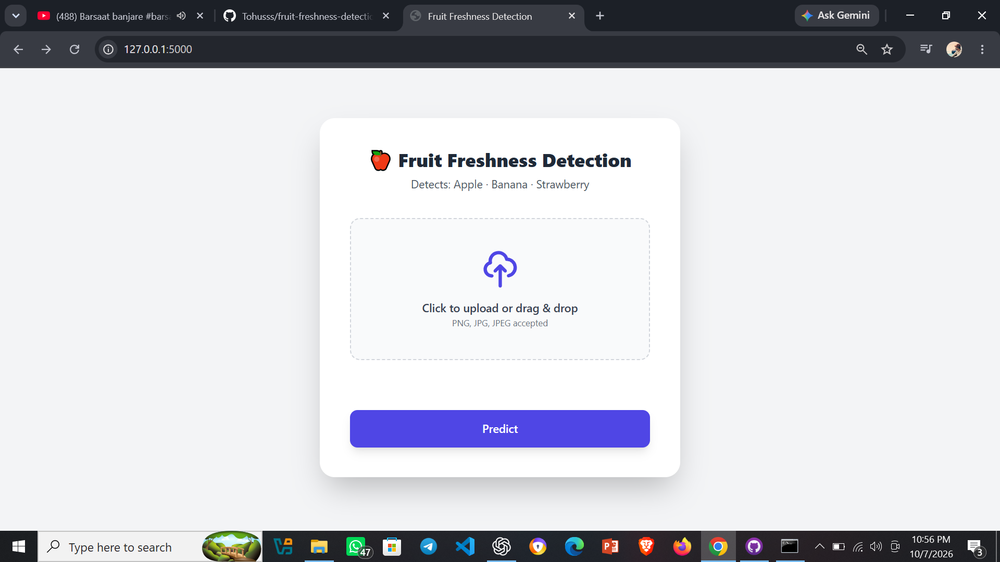

# Fruit Freshness Detection System

An image-based machine learning application for automated fruit freshness detection and classification.

## Features

- Detects fruit freshness from images
- Classifies fruit condition using deep learning
- Uses a ResNet18-based model
- Provides a simple web interface
- Displays prediction results clearly

## Technologies Used

- Python
- PyTorch
- ResNet18
- Flask
- HTML
- CSS
- Computer Vision
- Machine Learning

## Project Structure

- `src/` – source code for dataset handling, model logic, and prediction
- `web/` – web interface files
- `app.py` – main application entry point
- `models/` – trained model weights
- `data/` – sample dataset images
- `screenshots/` – application and prediction screenshots

## How to Run

1. Clone the repository

```bash
git clone https://github.com/Tohusss/fruit-freshness-detection.git
## Screenshots

### Application Interface


### Prediction Result

